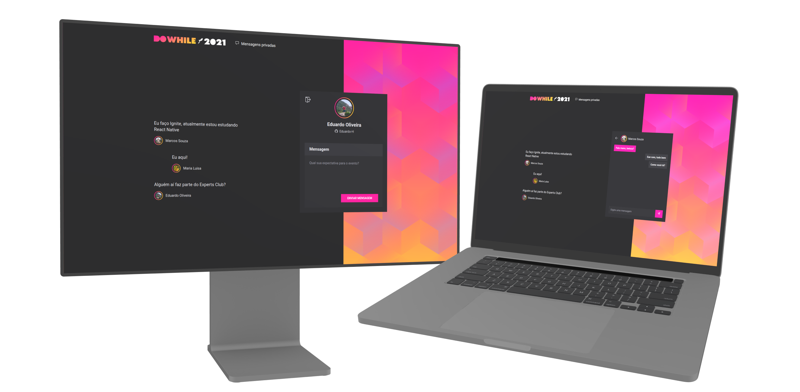

<h1 align="center">NLW Heat Web</h1>



## About
This project was build during the Next Level Week event, its main goal is to gather people to talk about their expectations for a future event, called DoWhile. After watching all classes, I decided to implement a private chat.

## Techonologies
- [React](https://reactjs.org/)
- [Vite](https://vitejs.dev/)
- [Framer Motion](https://www.framer.com) (animations)
- [Sass](https://sass-lang.com/)

## Dependencies
Since this project connects with Github, you'll need to create a oAuth app on your GitHub. You can follow this [tutorial](https://docs.github.com/en/developers/apps/building-oauth-apps/creating-an-oauth-app) to create the oAuth app. After creating it, you need to add the environment variables on the ```.env``` file.

### .env example
```
# GitHub
VITE_GITHUB_CLIENT_ID=YOUR_GITHUB_CLIENT_ID

# Sign In
VITE_SIGN_IN_URL=https://github.com/login/oauth/authorize?scope=user&client_id=YOUR_GITHUB_CLIENT_ID
```

Note: The project will only work correctly if the back-end project is running already, you can find the repository [here](https://github.com/Eduardo-H/nlw-heat-node).

## Usage
To run the project, you can follow these steps:
- Clone the repository with ```git clone https://github.com/Eduardo-H/nlw-heat-web```
- Navigate into the project's folder ```cd nlw-heat-web/```
- Install all the project's dependencies by running ```yarn```
- Run the project with ```yarn dev```